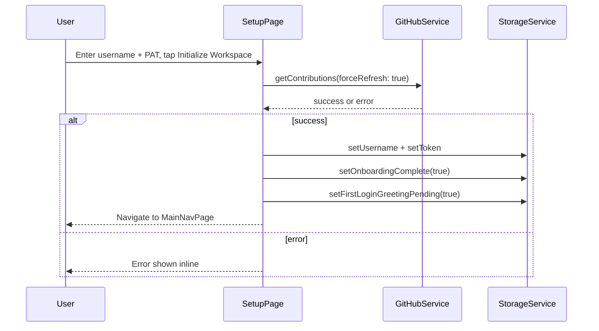
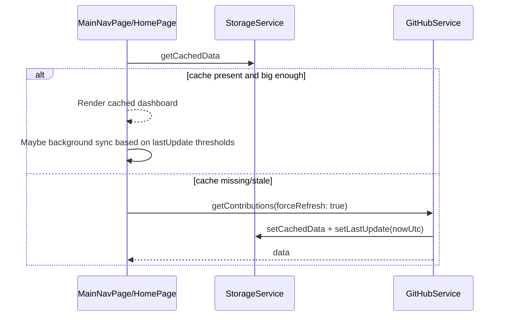

# GitWall Architecture & User Flows (Bug Discovery Notes)

## Stack
- Flutter app (Dart) with Firebase (Core, Messaging, Crashlytics, App Check)
- GitHub GraphQL over HTTPS
- Android wallpaper apply via a native MethodChannel + plugin fallback

## High-Level Modules
- Storage & credentials: [app_services.dart](file:///c:/Users/adell/Desktop/github_wallpaper/lib/app_services.dart)
- GitHub fetch + caching: [GitHubService](file:///c:/Users/adell/Desktop/github_wallpaper/lib/app_services.dart#L235-L389)
- Wallpaper generation/apply: [WallpaperService](file:///c:/Users/adell/Desktop/github_wallpaper/lib/app_services.dart#L404-L603)
- Push/background refresh: [_bgH + FcmService](file:///c:/Users/adell/Desktop/github_wallpaper/lib/app_services.dart#L642-L725)
- UI pages: [lib/pages](file:///c:/Users/adell/Desktop/github_wallpaper/lib/pages)

## App Boot Flow
```mermaid
flowchart TD
  A[main()] --> B[MyApp]
  B --> C[AppInitializer]
  C --> D[BootstrapService.boot]
  D --> D1[StorageService.init]
  D --> D2[Firebase.initializeApp]
  D --> D3[FirebaseAppCheck.activate]
  D --> D4[FcmService.init]
  D --> D5[AppConfig.initializeFromPlatformDispatcher]
  C --> E{StorageService.isOnboardingComplete?}
  E -->|false| F[OnboardingPage]
  E -->|true| G[MainNavPage]
```
- Entry: [main.dart](file:///c:/Users/adell/Desktop/github_wallpaper/lib/main.dart)
- Bootstrap: [BootstrapService.boot](file:///c:/Users/adell/Desktop/github_wallpaper/lib/app_services.dart#L744-L809)

## Registration/Login (Setup) Flow

- UI: [setup_page.dart](file:///c:/Users/adell/Desktop/github_wallpaper/lib/pages/setup_page.dart)

## Dashboard Data Sync Flow

- Controller: [main_nav_page.dart](file:///c:/Users/adell/Desktop/github_wallpaper/lib/pages/main_nav_page.dart#L64-L155)
- Cache write: [GitHubService.getContributions](file:///c:/Users/adell/Desktop/github_wallpaper/lib/app_services.dart#L241-L279)

## Wallpaper Apply (User-Initiated)
```mermaid
sequenceDiagram
  participant U as User
  participant C as CustomizePage
  participant N as MainNavPage
  participant WS as WallpaperService
  participant ST as StorageService
  participant AND as Android(MethodChannel)
  U->>C: Tap Set Wallpaper, choose target
  C->>ST: saveWallpaperConfig
  C->>N: onSetWallpaper(target)
  N->>WS: generateAndSetWallpaper(forceApply: true)
  WS->>WS: generate bytes + save to temp file
  WS->>AND: setWallpaperFromPath (native)
  alt native fails
    WS->>WS: plugin fallback wallpaper_manager_plus
  end
  WS->>ST: saveWallpaperResult(hash, path)
  N->>ST: setHasAppliedWallpaper(true) (Android)
```
- Apply entry: [CustomizePage._saveAndApply](file:///c:/Users/adell/Desktop/github_wallpaper/lib/pages/customize_page.dart#L102-L179)\n+- Apply implementation: [WallpaperService.generateAndSetWallpaper](file:///c:/Users/adell/Desktop/github_wallpaper/lib/app_services.dart#L423-L452)\n+- Android channel: [MainActivity.kt](file:///c:/Users/adell/Desktop/github_wallpaper/android/app/src/main/kotlin/com/rahulreddy/githubwallpaper/MainActivity.kt#L11-L97)

## Background Refresh (Push-Driven)
```mermaid
flowchart TD
  A[Cloud Scheduler] --> B[FCM data message type=refresh to topic]
  B --> C[App receives message]
  C --> D[_bgH background handler]
  D --> E[StorageService.init]
  E --> F{autoUpdate && hasAppliedWallpaper}
  F -->|true| G[setPendingWallpaperRefresh(true)]
  F -->|false| H[exit]
  I[Next app launch] --> J[AppInitializer sees pending]
  J --> K{autoUpdate && hasAppliedWallpaper}
  K -->|true| L[WallpaperService.refreshWallpaper]
  K -->|false| M[consumePending and skip]
```
- Server trigger: [functions/index.js](file:///c:/Users/adell/Desktop/github_wallpaper/functions/index.js)\n+- Background handler: [_bgH](file:///c:/Users/adell/Desktop/github_wallpaper/lib/app_services.dart#L642-L679)\n+- Startup consumption: [main.dart](file:///c:/Users/adell/Desktop/github_wallpaper/lib/main.dart#L124-L163)

